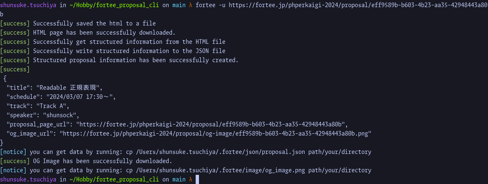

# Fortee Proposal Downloader

## Overview
This is a command line tool to download proposal data from fortee talk page.


## Warning
This tool is not officially supported by fortee. Use at your own risk.
Also, this is testing version. It may not work properly.

## Getting Started

```bash
git clone this repository
cd fortee-proposal-downloader
make install
fortee-cli --help
```

[example fortee talk page](https://fortee.jp/phpcon-2023/proposal/e42643e3-da14-47ef-b44b-414a8e31bc4b)

## Usage
### Download
```bash
git clone this repository
```

### Install & Uninstall
```bash
make install
make uninstall
```

### Help
```bash
fortee-cli --help
```

### Download proposal data
```bash
fortee-cli download --url {your_proposal_url_page}
```

### (For Developer) Run All Rust Pre-Commit Checks
```bash
make watcher
```

### (For Developer) Install Rust Pre-Commit Components (rustfmt, clippy, etc.)
```bash
make install-dev
```
